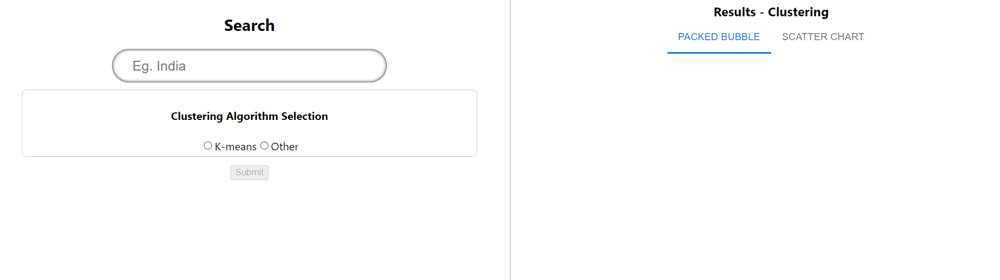
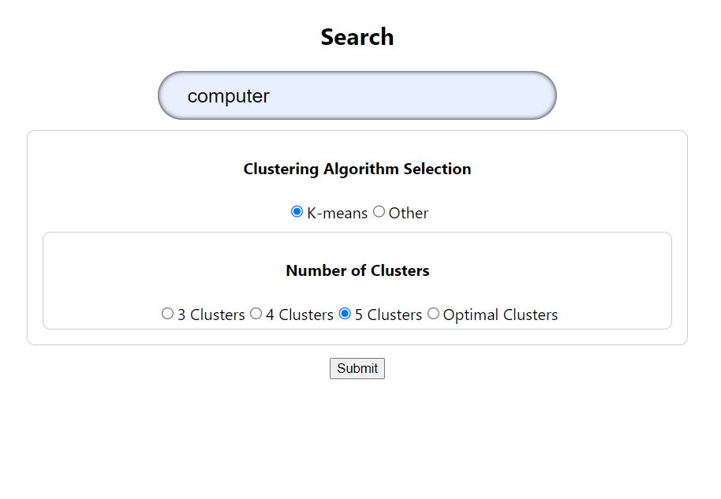
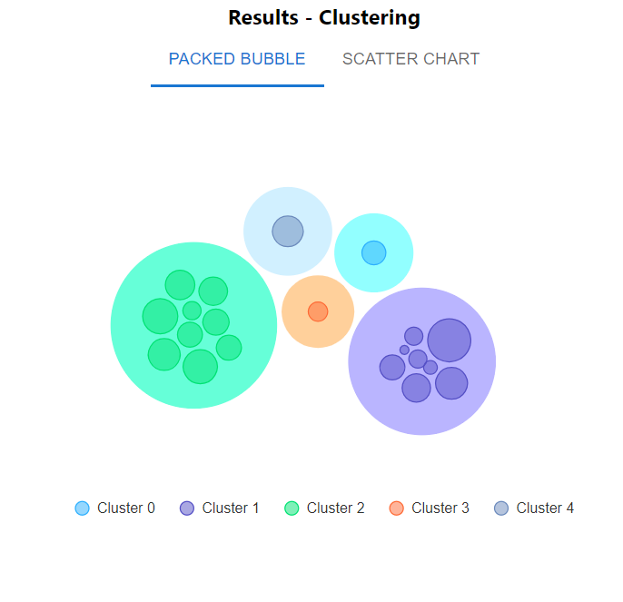
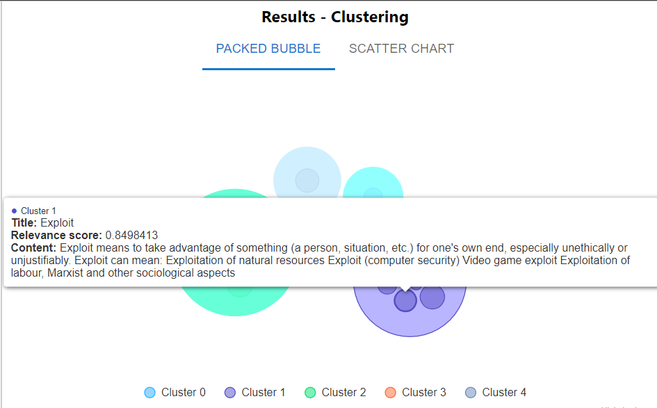
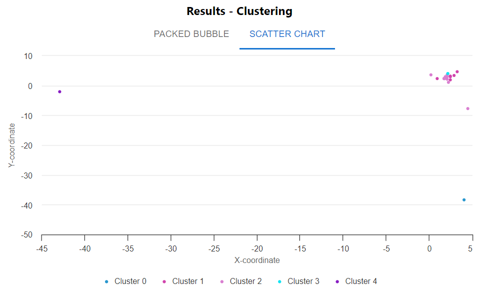

# **Search Result Clustering**

## Description
Clustering is an unsupervised machine learning algorithm to partition data points based
on similarity. 
- Implement a cluster based visualization of 10 (or more) relevant retrieved
results for a given search query. That is, no standard list based result visualization is
used here but a visualization that supports exploration by illustrating the relation (e.g.
similarity) between the results.

__Note__: You can use any simple clustering algorithms like Kmeans or HAC. You can also use Solr feature
for result clustering. Use any Java/Python based
Machine Learning library like WEKA 3.8 or Python Sk-learn.

---

## **Tech Stack and Libraries Used**
### **Technology**:
- **Python**: Documents collection (Web scraping)
- **Java**: Backend
- **React TypeScript**: Frontend

### **Libraries**:
- **Lucene**: Relevant document retrieval
- **Weka**: Clustering
- **Highcharts**: Cluster visualization

---

## **Home Page**

### **Preprocessing and Resource Collection**
1. Run the `document_data_generator.py` file to generate **1000 .txt documents**.
2. These documents are indexed using the **Lucene library** (inverted indexing) after the server is started.  
   - **Note**: Before indexing, the indexing directory is cleared.

---

## **Input**
1. The user is prompted for:
   - Search query.
   - Type of clustering algorithm.
   - Number of clusters.
2. Input parameters are verified:
   - If input values are valid, processing continues.
   - If input is invalid, no display is shown.

---

## **Processing**
1. Based on the similarity metric, the **top 20 documents** are retrieved.
2. These documents are grouped into **K clusters** using the **K-means clustering algorithm**.
3. Text data is vectorized using the **Tf-idf weighting scheme** for the retrieved documents.
4. Data instances are converted to **Weka instances** to make them compatible with the Weka library for clustering.
5. Clustering process:
   - If the **k value** is entered, clustering occurs based on it.
   - If the "optimal clusters" option is selected, the **k value** is determined by testing clustering for various values of \(k\).
6. Dimensionality reduction is performed using **Principal Component Analysis (PCA)** to display data instances in a 2D space.

---

## **Output**
1. The frontend is built using **React TypeScript (ReactTs)**.
2. The output is displayed as:
   - **Clusters**.
   - **Scatterplot**.
3. Additional details:
   - Hovering over clusters shows the **data instances** grouped within, along with their:
     - Title.
     - Content.
     - Relevance score.

---

## **Visualization**
Here are some images from the clustering process:

### **Home Page**

---

### **Input & Preprocessing**

---

### **Clustering and Output**

 

---
